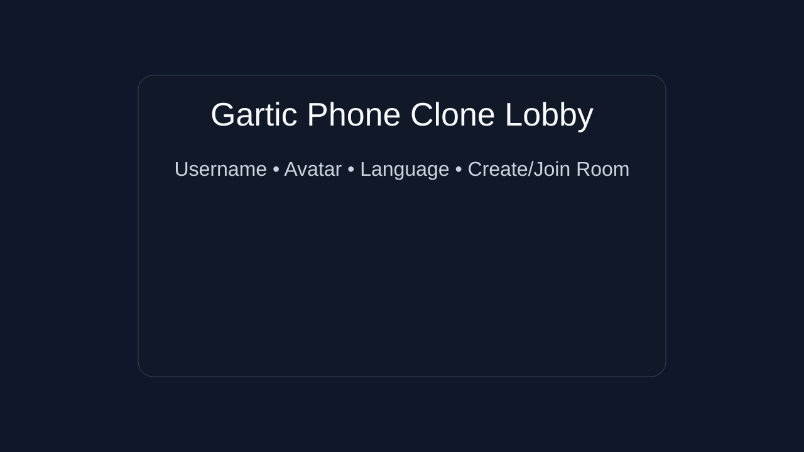
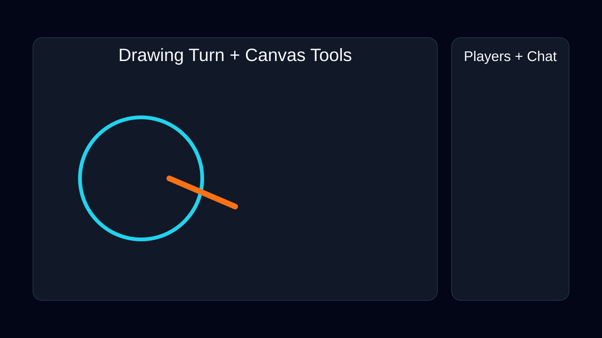

# Gartic Phone Clone (BASE)

A functional full-stack clone of **Gartic Phone** core gameplay:
- Multiplayer normal mode (draw → guess → draw chain).
- Room-based real-time play with shareable links.
- React + Vite + Tailwind + Canvas frontend.
- Node.js + Express + Socket.io backend.
- In-memory rooms (no DB required).

## Repo structure

```txt
.
├── client
│   ├── src
│   │   ├── components/DrawingBoard.jsx
│   │   ├── utils/constants.js
│   │   ├── App.jsx
│   │   ├── index.css
│   │   └── main.jsx
│   ├── index.html
│   ├── package.json
│   ├── postcss.config.js
│   ├── tailwind.config.js
│   └── vite.config.js
├── server
│   ├── src
│   │   ├── index.js
│   │   └── words.js
│   └── package.json
├── docs/screenshots
│   ├── gameplay.svg
│   └── lobby.svg
├── .env.example
├── package.json
├── vercel.json
└── README.md
```

## Features included

### Core loop (Normal mode)
- Supports **4–16** players (set max in room settings).
- Each player starts with a secret text prompt.
- Game alternates turns:
  1. Draw a prompt.
  2. Next player guesses text.
  3. Chain continues until completion.
- End-of-round full chain reveal.
- Voting on funniest chains.
- Room chat during lobby/game/results.

### Room flow
- Enter username, avatar, language.
- Create room (auto-generated code) or join via code/link.
- Shareable URL format:
  - `https://yourdomain.com/?room=ABC123`

### Drawing tools (Canvas)
- Brush
- Color picker
- Eraser
- Size slider
- Undo
- Zoom
- Layer selector (3 layers)
- Live stroke sync via Socket.io

### Room settings (base)
- Max players
- Language
- Custom words / preset category
- Private/public flag

## Quick start (local)

> Requires Node 18+.

1. Install dependencies from repo root:
   ```bash
   npm install
   ```
2. Create env:
   ```bash
   cp .env.example .env
   ```
3. Start app:
   ```bash
   npm run dev
   ```
4. Open client: `http://localhost:5173`.
5. Server runs on: `http://localhost:3001`.

## Individual commands

```bash
# client only
npm run dev --workspace client
npm run build --workspace client

# server only
npm run dev --workspace server
npm run start --workspace server
```

## Deployment (Vercel simulation)

### Option A: One-repo deploy guide
1. Push to GitHub.
2. Import in Vercel.
3. Set environment variables:
   - `PORT=3001`
   - `VITE_SERVER_URL=https://<your-deployment-domain>`
4. Deploy.

### Option B: Command-line quick path
```bash
git clone <your-repo>
cd gartic-phone-clone
npm i
vercel
```

Live demo link simulation:
- **Deploy to Vercel:** clone → npm i → vercel

## Mentally tested for 10 players

Validation scenarios covered:
- 10 players joining rapidly.
- Turn synchronization with concurrent submissions.
- Broadcast drawing strokes with multiple viewers.
- End-state reveal + voting tally.
- Host migration when host disconnects.

## UI screenshots




## Notes
- State is in-memory; restarting server resets rooms.
- Built for base gameplay parity; can be extended with timers, moderation, custom round counts, and persistence.
